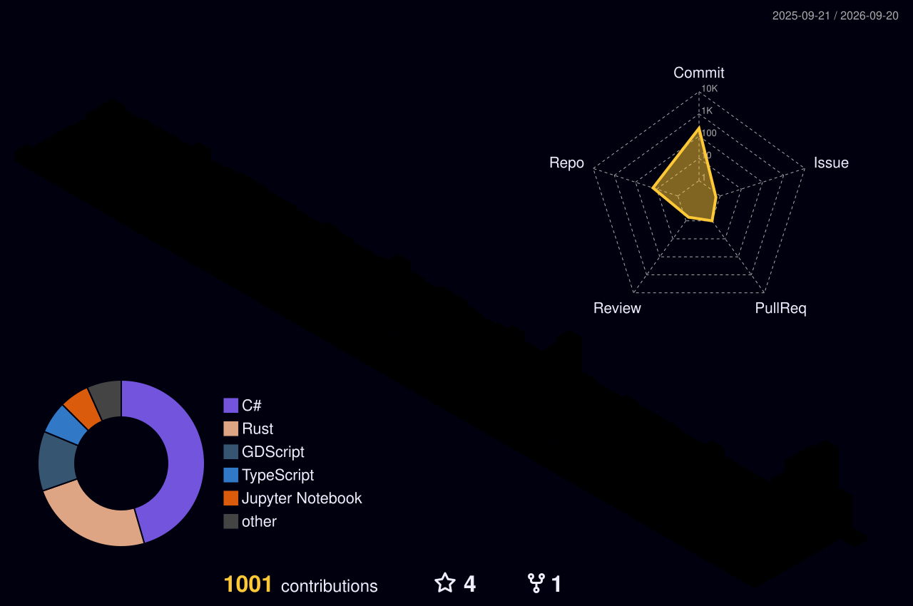

# Hi, I'm Nigel 

### Applied AI Engineer

**Unifying AI with our digital world, physical universe and the Internet of Everything**

 

---

## About

I build **AI systems** — agentic architectures, LLM pipelines and deep learning — and wire them into the physical and digital world:

`Human–Computer Interaction`  ·  `Software & Apps`  ·  `Hardware, IoT & Embedded`  ·  `Processes`  ·  `Data & Knowledge Bases`

> Building unified intelligent systems.

---

## Languages

  &nbsp;&nbsp;
  &nbsp;&nbsp;
  &nbsp;&nbsp;
  

---

## Stack

A Rust core, native shells on every platform, and agentic AI throughout.

#### 🤖 &nbsp;Agentic AI

#### 🧠 &nbsp;AI / ML Engineering

#### 📱 &nbsp;Cross-Platform — Crux core, native shells

#### ⚙️ &nbsp;Backend & Data

#### ☁️ &nbsp;Cloud & DevOps

---

## What Drives Me

> I believe true AI innovation happens at the intersection of code, hardware, and human experience.
> My goal is to build systems that connect everything — and everyone — intelligently.

---

## Off the Circuit

When not engineering the future, you'll find me:

🏸 &nbsp;Playing badminton &nbsp;&nbsp;·&nbsp;&nbsp; ⛳ &nbsp;Hitting the greens *(handicap: 15)*

---

## GitHub

<!-- Rendered into this repo by .github/workflows/profile-3d-contrib.yml — served from the repo, so it cannot 404 -->

---

### Let's Connect

Want to collaborate, chat about AI, or challenge me to a badminton match? Get in touch.

